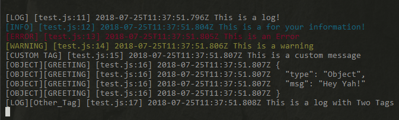
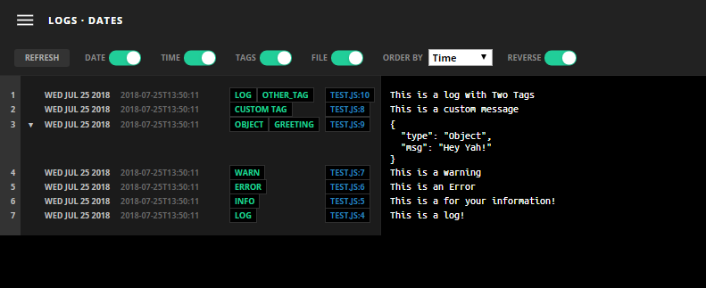

# Better Log Management

[](https://nodei.co/npm/scribe-bus/)

Take your console logs like these:



Into a web dashboard  like this:




## The Challenge
Managing logs can be a daunting task. Especially as your app grows and you need a central log manager. How do you keep uniform logs across your app and how do you then access the same logs.

## Enter Redis PubSub

That's where Redis comes in handy. Using the PubSub system, we are able to listen for logs from a central location.

## Logging & Exposing Logs
The next challenge is how to save the logs on disk and later access them. For this, we use the awesole [Scribe-Js](https://github.com/bluejamesbond/Scribe.js) module.

Scribe JS manages the error logs and helps us expose them via an Express JS server.

## How To Log Your Messages

First install the module. ```yarn add scribe-bus```

### Logging within your app
Use the following code within your app. Note: This logger does not replace the default **console** (as Scribe-Js works by default).

```javascript

    //pass redis configurations
    var options = {
        redis: {
            port: 6379,
            host: '127.0.0.1'
        }
    }
    //get the logger instance...
    var {logger} = require('scribe-bus')(options);

    //log away!
    logger.log('This is a log!')
    logger.info('This is a for your information!')
    logger.error('This is an Error')
    logger.warn('This is a warning')

    /**
     * BY default, the log level (info,log,error) etc is used as a tag for your logs.
     * But you can also use custom tags.
     * Just add your tags as a string or array as the 2nd argument.
     * Note: The custom level allows you to define own logs
     **/
    logger.custom('This is a custom message', 'CUSTOM TAG');

    //This is a custom log with two tags
    logger.custom({type:"Object", msg: "Hey Yah!"}, ['OBJECT','Greeting']);
    
    //This also has two tags 1. Level Tag "Log" & "Other_Tag"
    logger.log('This is a log with Two Tags', 'Other_Tag');


```

## Listen to PubSub & Serve Your Logs
Note: The code above does not save any actual logs. To do so, you will need to invoke the **```listen()```** method;
    
```javascript
    var {logger} = require('scribe-bus');
    logger.listen()
```

However, if you listen in multiple places within your code, then you will end up creating duplicate events for each will listen to the same exact pub-sub channel/key. 

Therefore, the recommended method is to launch a single Express server application that runs the ```logger.listen()``` method.

Below is a simple server application (also see *server.js* in *examples* folder)

```javascript

    var express = require('express');
    var app = express();

    //redis options
    var options = {
        redis: {
            port: 6379,
            host: '127.0.0.1'
        }
    }

    //get scribe & logger instances
    var {scribe, logger} = require('scribe-bus')(options);

    //listen for subscribed events
    logger.listen()

    //use the scribe WebPanel
    app.use('/logs', scribe.webPanel());

    //... the rest of the server code

    var port = 3000;

    app.listen(port, function () {
        console.log(`Started server at port ${port}`);
    });

```

This server achieves two purposes.
- It creates a pub-sub listener that syncs all log-events with the logger for saving in disk.
- It spins a route "/logs" (change to whatever suits you) that can then be used to access your logs by going to [http://localhost:3000/logs](http://localhost:3000/logs).

You can also drop the three lines needed into any existing express server app and it will work.

# API

## Initialization
**```var {scribe, logger} = require('scribe-bus')(options);```**

## Logging
**```logger[log-level](msg, tags)```** : 
- **log-level**: is one of (*'log/warning/error/info/dir/custom'*) e.g. log.info("Your Message")
- **msg**: A string or object that you wish to log
- **tags**: A tag (String) or Array of tags you wish to add to the message. Note: The *"log-level"* above is always appended as a tag.


